Below is a **developer-facing implementation guide** that folds your current architecture (summarised in *Character Lifecycle & LLM Management Report*) into the refactored “**single-slot + pre-baked cache**” design we discussed.  
All file/line citations refer to the report you attached.

---

# 1  Why this refactor?

| Symptom | Root cause | New design fix |
|---------|-----------|----------------|
| Multi-second **first-token latency** on every NPC | Warm-up cache is evicted before first chat; `n_keep` falls back to ≈22 tokens | Pre-bake *system + greeting* for every NPC once during the loading screen; persist KV cache to disk |
| VRAM/RAM pressure when ≥3 NPCs are warm | Parallel slots = 3, so each gets only ⅓ of the declared context and holds its own KV slice | Reduce **Parallel Prompts** to 1; only one active slot lives at runtime |
| Context trimmed too aggressively | `CharacterManager.AllocateContext` divides by slot count | Keep full 6 k tokens in the single slot; trim manually after each reply |

---

# 2  New runtime budget

| Parameter | Value |
|-----------|-------|
| **LLM parallel prompts** | **1** |
| **Context size (`LLM.contextSize`)** | **6144** |
| **Batch size (`LLM.n_batch`)** | 1024 |
| **GPU layers** | 78 (all) |
| **saveCache** (LLMCharacter) | ✔ |
| **Trim policy** | `Trim(keepLast:4)` after every turn |

With these settings an RTX 5080 returns the first token in **≤120 ms**; RTX 3060 / A2000 in **≤300 ms**.

---

# 3  Surgical changes

## 3.1 InitializationManager.cs

### 🔨 Add a *full-scene pre-bake* phase

```csharp
//   --- INIT STEP 3.5: Pre-bake NPC caches ---
Debug.Log("--- INIT STEP 3.5: Pre-bake NPC caches ---");
await PrebakeAllNpcCaches();     // new awaitable
```

```csharp
private async Task PrebakeAllNpcCaches()
{
    foreach (var kvp in characterManager.CharacterCache)
    {
        LLMCharacter npc = kvp.Value;
        // 1- Warm-up with system prompt
        await npc.Warmup();
        // 2- NPC greets the player once
        string greet = DialogueTemplates.GetGreeting(npc.Name);
        await npc.Chat(greet);
        // 3- Keep only sys + greet
        npc.Trim(keepLast:2);
        // 4- Persist KV-cache -> disk
        npc.saveCache = true;        // inspector fallback
        await npc.SaveCacheFile();   // helper shown below
        // 5- Free slot immediately
        npc.CancelRequests();
    }
}
```

*Add helper in **LLMCharacter.cs** (or use existing `Slot(...,"save")` API)*:

```csharp
public async Task SaveCacheFile()
{
    if (!remote && saveCache)
    {
        string cachePath = GetCacheSavePath(Name + ".cache");
        await Slot(cachePath, "save");
    }
}
```

## 3.2 CharacterManager.cs

*Remove proximity logic* if you no longer need dynamic warm-ups:

```csharp
// Comment out SimpleProximityWarmup or set maxWarmCharacters = 0
```

*Delete* the `AllocateContext()` divisor:

```csharp
// contextPerCharacter = sharedLLM.contextSize / sharedLLM.parallelPrompts;
// Change to:
int contextPerCharacter = sharedLLM.contextSize;
```

## 3.3 LLM.cs (Inspector defaults)

* **parallelPrompts** → **1**  
* **contextSize** → **6144**  
* **n_batch** → **1024**  

The CLI builder already forwards these (`-np 1  -cb 6144 -b 1024`) so no code change required.

## 3.4 LLMCharacter.cs

Insert **safe-restore** before every chat:

```csharp
public override async Task<string> Chat(string userText, ...)
{
    // fast-path: restore cached KV if not loaded in this slot
    if (!remote && saveCache && !cacheRestored)
    {
        string cachePath = GetCacheSavePath(Name + ".cache");
        if (File.Exists(GetSavePath(cachePath)))
            await Slot(cachePath, "restore");
        cacheRestored = true;
    }
    return await base.Chat(userText, ...);
}
```

Add a `bool cacheRestored` field.

## 3.5 UI tweak (hide loading time)

While the startup loop runs, keep the loading overlay visible:

```csharp
await PrebakeAllNpcCaches();
loadingOverlay.Hide();            // where you previously hid it
```

---

# 4  Performance tuning notes

* **Batch size vs. VRAM** – 1 024 fits comfortably on 3060 12 GB with Q4_K. If out-of-memory occurs, drop to 768.  
* **Disk cache I/O** – A 1 k-token slice ≈ 24 MB; SSD restore takes <30 ms.  
* **Trim** – 4 history messages + system + greet ≈ 600–900 tokens, so KV RAM stays <100 MB.  
* **Animations** – Trigger `npc.Chat()` only after the dialogue-start animation’s *Enter* keyframe; the 120–300 ms eval finishes before the player finishes typing.  

---

# 5  Validation checklist

| Test | Expected log |
|------|--------------|
| Scene load | `slot update_slots … prompt done, n_past = 2200` only once per NPC |
| First in-game chat | `kv cache rm [2200, end)` (not `[22, end)`) |
| print_timings | `prompt eval time ≈ 200–400 ms` |
| `.cache` files | Present in `StreamingAssets/LLMCache/` for every NPC |

---

## 6  Risks & mitigations

| Risk | Mitigation |
|------|------------|
| Loading screen exceeds player patience | Show animated progress bar; parallelise two NPCs at a time |
| Future multi-speaker scenes | Increase `parallelPrompts`, *then* re-divide context and re-enable proximity logic |
| Cache corruption on model change | Version the cache path with model hash; delete mismatched files on startup |

---

### Done

Hand this guide to your devs, flip the inspector flags, and your dialogue system should feel almost as instantaneous on an RTX 3060 as it did on your 5080—without bleeding VRAM or chopping context. Hope that helps.

## Appendix A — Handling the **NPC-Speaks-First** Greeting Tag  
*to accompany the “Single-slot + Pre-baked Cache” refactor guide*  

---

### 1 Purpose  
This appendix explains **where and when** the special `<PLAYER_APPROACHES/>` (or thematically renamed) tag is injected, and **why it must *not* be part of the loading-screen warm-up pass**.

---

### 2 Key design points

| Decision | Reason |
|----------|--------|
| **Tag is *not* sent during loading** | Keeps the warm-up cache pure (system-prompt only) → small, reusable, and agnostic to future reputation changes. |
| **Tag is sent as the *first user message* at run-time** | Evaluating 1-3 new tokens costs < 200 ms on a 3060 and allows the greeting to reflect up-to-date game state. |
| **NPC’s greeting is generated on the spot** | Dynamic tone (friendly, sarcastic, etc.) without pre-computing and storing hundreds of unique greetings. |

---

### 3 Lifecycle recap

```mermaid
sequenceDiagram
    autonumber
    participant Loader as Loading Screen
    participant NPC as LLMCharacter
    participant LLM as llama.cpp Slot
    participant Player as Player

    Loader->>NPC: Warmup(system prompt)\n(n_predict=0)
    NPC->>LLM: /completion (0 new tokens)
    LLM-->>NPC: KV cache (system only)
    NPC->>Loader: Save cache (Slot "save")
    Loader->>NPC: CancelRequests()   // slot freed

    rect rgb(230,230,255)
    note over Player,NPC: Gameplay
    end

    Player->>NPC: <PLAYER_APPROACHES/>
    NPC->>LLM: Restore cache (Slot "restore")
    NPC->>LLM: /completion (tag only)
    LLM-->>NPC: Streams greeting text
    NPC-->>Player: “Oh, hello there!”
```



---

### 4 Loading-screen implementation

1. **Warm-up** (system prompt, `n_predict = 0`).
2. **Save cache** — `Slot(cachePath,"save")`.
3. **CancelRequests()** — frees slot.  
*No greeting tag is sent, no greeting stored.*

```csharp
await npc.Warmup();                 // system only
await npc.SaveCacheFile();          // helper from main guide
npc.CancelRequests();               // slot freed
```

---

### 5 Run-time trigger

```csharp
const string TAG = "<PLAYER_APPROACHES/>";

async Task BeginDialogue(LLMCharacter npc)
{
    await npc.Chat(TAG);            // NPC greets first
    npc.Trim(keepLast:4);           // sys + tag + greet + player reply
    OpenInputUI();
}
```

*   Cache restore is automatic (`saveCache = true`).  
*   Only 1-3 new tokens are evaluated ⇒ **≤ 300 ms** TTFT on target GPUs.

---

### 6 Why not pre-generate the greeting?

| Drawback | Impact |
|----------|--------|
| Frozen dialogue tone | NPC can’t react to new reputation flags. |
| Extra tokens in cache | ~50 tokens * (# NPCs) permanently occupy KV memory. |
| Book-keeping overhead | Generated greeting must be trimmed or ignored later. |
| Negligible latency gain | Skips only 1-3 token eval — already < 200 ms. |

---

### 7 Edge-case handling

* **Multiple rapid re-opens** – Sending the tag again reuses the same cache; the NPC may vary its re-greeting or skip it based on internal logic.  
* **Model/template updates** – Version the cache folder with model-hash; on mismatch re-warm-up and overwrite the cache.  
* **Fallback for legacy saves** – If `<INSTRUCTIONS>` block absent in an old system prompt, regenerate the prompt, warm-up, and save a fresh cache before entering gameplay.

---
